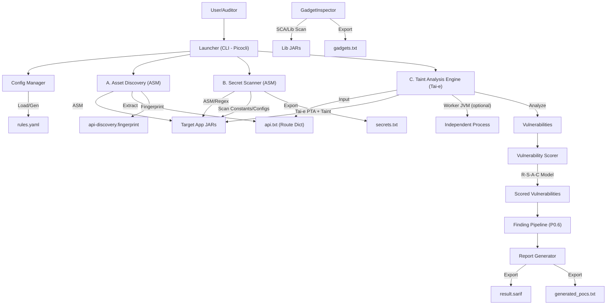

# JByteScanner Software Design Document (SDD)

## 1. Overview

*   **Project Name**: JByteScanner (Java Bytecode Security Scanner)
*   **Core Engine**: ASM (OW2) + Tai-e 0.5.4 (Java Bytecode Semantic Analysis)
*   **Target Audience**: Security Auditors, Security Researchers
*   **Key Value Proposition**: Single JAR execution, low memory footprint, database-free, highly configurable, and standardized SARIF output.

## 2. Architecture

The tool adopts a **"Dual-Engine Microkernel"** architecture, decoupling lightweight bytecode extraction (ASM) from heavyweight semantic analysis (Tai-e worker) to address memory consumption and stability issues.



### Core Modules

1.  **Loader Module**
    *   **Responsibility**: Handles input directories, identifying all `.jar`, `.war` files. Automatically unpacks nested structures in SpringBoot/FatJARs (`BOOT-INF/classes`, `WEB-INF/classes`, `BOOT-INF/lib`) and exploded web applications.
    *   **Smart Package Inference**: Automatically infers business package names (`scan_packages`) from class distribution when not explicitly configured.
    *   **Classpath Preflight (P0.2)**: SHA-256 deduplication, version conflict mediation, mixed/shaded JAR application scope extraction. Outputs `classpath-preflight.json`.
    *   **Role Classification**: Separates JARs into `targetAppJars` (business code), `depAppJars` (dependency application code), and `libJars` (third-party libraries).

2.  **Configuration Manager**
    *   **Logic**: Checks for `rules.yaml` in `.jbytescanner/` on startup. If missing, extracts a default template from JAR resources; otherwise loads the existing one.
    *   **Rules Migration**: Versioned migration (`rules_version`) backs up legacy project rules and merges newly bundled sources/sinks without overwriting user overrides.
    *   **Project Workspace**: Prioritizes reading configuration from `.jbytescanner/rules.yaml`, enabling isolated configurations per scan target.

3.  **Discovery Engine (Lightweight - ASM)**
    *   **Goal**: Rapid API route extraction without loading the full Tai-e World.
    *   **Technology**: OW2 ASM for bytecode annotation/class scanning. Scans only `targetAppJars`.
    *   **Function**: Traverses class annotations (`@RestController`, `@Controller`, `@RequestMapping`, `@GetMapping`, etc.) and inheritance hierarchies (`HttpServlet`, `@WebServlet`, `@Path` for JAX-RS). Also discovers routes from `web.xml` embedded in JARs.
    *   **Output**: Writes `api.txt` and `api-discovery.fingerprint` to `.jbytescanner/`.
    *   **Human-editable**: `api.txt` is treated as a curated whitelist. Once it exists, the tool will **not** auto-overwrite it even when the classpath changes. Use `-m api` to regenerate.

4.  **Taint Engine (Heavyweight - Tai-e)**
    *   **Technology**: Tai-e 0.5.4's `JavaWorldBuilder` frontend, Pointer Analysis (PTA), and taint analysis plugin.
    *   **Strategy**: Entry points from `api.txt` are registered as Tai-e taint sources. The `RuleManager` translates JByteScanner's `rules.yaml` into Tai-e's `taint-config.yml` format.
    *   **Worker Isolation (P0.3)**: Tai-e analysis runs in an independent worker JVM (`TaieWorkerLauncher`) with configurable heap (`--max-heap-mb`) and timeout (`--timeout-minutes`). Results are serialized back to the main process via structured JSON.
    *   **Optimization**: Application-only scope (`only-app:true`), call-site taint mode, persistent source modeling, typed cache accessor inference, taint config sharding for large rule sets.

5.  **Report Generator**
    *   **Format**: SARIF v2.1.0, enabling direct integration with VSCode, GitHub Security, etc.
    *   **Finding Pipeline (P0.6)**: Pre-report processing with Sink strength classification, package provenance, deduplication, and four-tier output (raw/suppressed/low-confidence/main SARIF).
    *   **PoC Generator**: Creates Burp Suite-compatible HTTP request payloads for discovered vulnerabilities with context-aware Content-Type and parameter binding.

6.  **Secret Scanner (Tactical - ASM)**
    *   **Technology**: ASM bytecode string extraction + Regex/Entropy analysis. Scans only `targetAppJars`.
    *   **Capabilities**: Config file scanning (`application.properties/yml`), string constant pool scanning, entropy detection (>4.6), Base64 decode + recursive scan, context-aware hash detection.

7.  **Gadget Inspector (SCA)**
    *   **Goal**: Recommend usable deserialization gadget chains based on detected library dependencies.
    *   **Technology**: `ScaScanner` identifies library versions from `pom.properties`, MANIFEST.MF, and JAR filename parsing. `GadgetInspector` matches detection results against an embedded `gadgets.json` database of 400+ known gadgets.
    *   **Output**: Writes `gadgets.txt` to the workspace, grouped by dependency set.

8.  **Vulnerability Scorer**
    *   **Model**: **R-S-A-C** (Reachability * Severity * Auth * Confidence).
    *   **Auth Detection**: Heuristically identifies `@PreAuthorize`, `@Secured`, and other auth annotations.
    *   **Worker-compatible**: Auth scoring works without depending on the host-side Tai-e `World`.


## 3. Technology Stack & Principles

### 3.1 Technology Selection
*   **Bytecode Scanning: OW2 ASM**
    *   *Rationale*: Lightweight, low-memory class file visitor framework. Used for route extraction, secret scanning, and SCA without loading classes into a JVM-level type system.
*   **Semantic Analysis: Tai-e 0.5.4**
    *   *Rationale*: State-of-the-art open-source static analysis framework from Nanjing University (OOPSLA'25). Provides native phantom class support, `invokedynamic`/Lambda handling, pointer analysis (PTA), and a configurable taint analysis plugin. Unmodified Tai-e runs in an isolated worker JVM.
*   **CLI Framework: Picocli**
    *   *Rationale*: Modern, type-safe command-line parsing with built-in help generation.
*   **Configuration: YAML (SnakeYAML)**
    *   *Rationale*: Human-readable, hierarchical structure suitable for nested rules (Sources/Sinks/Transfers).
*   **Reporting: SARIF**
    *   *Rationale*: OASIS standard for static analysis tools, enabling seamless integration with CI/CD pipelines (GitHub Actions, GitLab CI) and IDEs (VSCode).

### 3.2 Technical Principles & Algorithms
The core analysis relies on **Inter-procedural Data Flow Analysis** via Tai-e.

#### A. Tai-e IR & World Building
Tai-e's `JavaWorldBuilder` frontend directly processes Java bytecode to build:
*   **World**: The complete class hierarchy with phantom class support (missing dependencies are modeled as stubs rather than causing crashes).
*   **IR (SsaIR)**: Tai-e's SSA-based intermediate representation, enabling precise def-use chain construction.

#### B. Pointer Analysis (PTA)
Tai-e supports configurable context-sensitive pointer analysis (e.g., `cs:ci`, `cs:2-obj`, `cs:2-type`).
*   *Benefit*: Object-sensitive pointer analysis significantly reduces false positives compared to CHA, while Tai-e's efficient implementation maintains practical performance on large projects.

#### C. Taint Analysis
The taint analysis plugin runs on top of PTA results:
1.  **Source Identification**: API parameters from `api.txt` are translated into entry methods. `RuleManager` maps `rules.yaml` sources/sinks/transfers into Tai-e's `taint-config.yml`.
2.  **Propagation**: Context-sensitive taint propagation through pointer analysis results and transfer rules.
3.  **Sink Matching**: Tainted values reaching configured sink methods are captured as `TaintFlow` results.
4.  **Flow Capture**: `JBSScanEntryPointPlugin` collects all `TaintFlow` instances for downstream processing.

### 3.3 Worker Isolation (P0.3)
Tai-e World building, PTA, and taint analysis run in an isolated JVM (`TaieWorkerLauncher`):
*   **Input**: App classpath, library classpath, generated `taint-config.yml`, entry methods.
*   **Output**: Structured JSON (`worker-result.json`) containing `TaintFlow` set and analysis metadata.
*   **Benefits**: Heap isolation (OOM in worker doesn't crash host), configurable JVM args (`-Xmx`, heap dump on OOM), timeout support.

## 4. Detailed Design & Solutions

### 4.1 API Route Extraction (api.txt)

ASM-based `AsmRouteExtractor` scans bytecode directly without loading classes via a class loader.

*   **Recognition Logic**:
    *   **Spring Boot**: Scan `@RestController`, `@Controller` on classes and `@RequestMapping`, `@GetMapping`, `@PostMapping`, etc. on methods. Parse `value`/`path` attributes, merge with class-level path prefixes.
    *   **Servlet**: Scan `web.xml` in JAR archives and classes with `@WebServlet` or extending `javax.servlet.http.HttpServlet`.
    *   **JAX-RS**: Scan `@Path`, `@GET`, `@POST`, `@PUT`, `@DELETE`, `@HEAD`, `@OPTIONS`, `@PATCH` and other JAX-RS annotations.
*   **Output Format**: `METHOD /path className methodSig | {"params":[...], "annotations":{...}, "contentType":"..."}`
*   **Human-editable**: `api.txt` is a curated whitelist. Once present, the scanner respects user edits and skips re-discovery (use `-m api` to force regeneration).

### 4.2 Pain Points 2 & 3: Configurable Source/Sink (YAML)

We will use Jackson or SnakeYAML.

**Configuration Structure (rules.yaml):**
```yaml
config:
  max_depth: 10
  scan_packages: ["com.example", "cn.service"] # Limit scan scope

sources:
  - type: "annotation"
    value: "org.springframework.web.bind.annotation.RequestParam"
  - type: "method"
    signature: "<javax.servlet.http.HttpServletRequest: java.lang.String getParameter(java.lang.String)>"

sinks:
  - type: "method"
    vuln_type: "RCE"
    signature: "<java.lang.Runtime: java.lang.Process exec(java.lang.String)>"
```
**Startup Logic**:
```java
File configFile = new File("rules.yaml");
if (!configFile.exists()) {
    ResourceUtil.extract("/default_rules.yaml", "."); 
    Logger.info("Created default rules.yaml.");
}
Config config = ConfigLoader.load(configFile);
```

### 4.3 Memory Optimization

Tai-e and the dual-engine architecture provide memory efficiency through:

1.  **ASM Discovery**: API extraction and secret scanning use lightweight ASM visitors that never load classes into a JVM type system, keeping heap footprint minimal.
2.  **Worker Isolation**: Tai-e World, PTA, and taint analysis run in an isolated worker JVM. If the worker OOMs, the host process remains alive and can report partial results.
3.  **Application-Only Scope**: Only `targetAppJars` are treated as application code for IR generation and PTA. Library jars stay on classpath with signature-only resolution.
4.  **Phantom Classes**: Tai-e natively supports incomplete classpaths, modeling missing classes as phantom stubs. No more `DANGLING` exceptions from missing optional dependencies.
5.  **Taint Config Sharding**: Large sink rule sets are automatically sharded to fit within SnakeYAML document size limits, reducing serialization overhead.
6.  **Classpath Preflight**: Duplicate artifact detection and version selection happen before analysis, preventing redundant class loading across identical JARs.

### 4.4 Pain Point 5: SARIF Report

Use `sarif-java-sdk` or manually construct the JSON structure.

```json
{
  "version": "2.1.0",
  "runs": [
    {
      "tool": { "driver": { "name": "JByteScanner" } },
      "results": [
        {
          "ruleId": "RCE",
          "message": { "text": "Detected RCE flow from Controller to Runtime.exec" },
          "locations": [ ... ]
        }
      ]
    }
  ]
}
```
