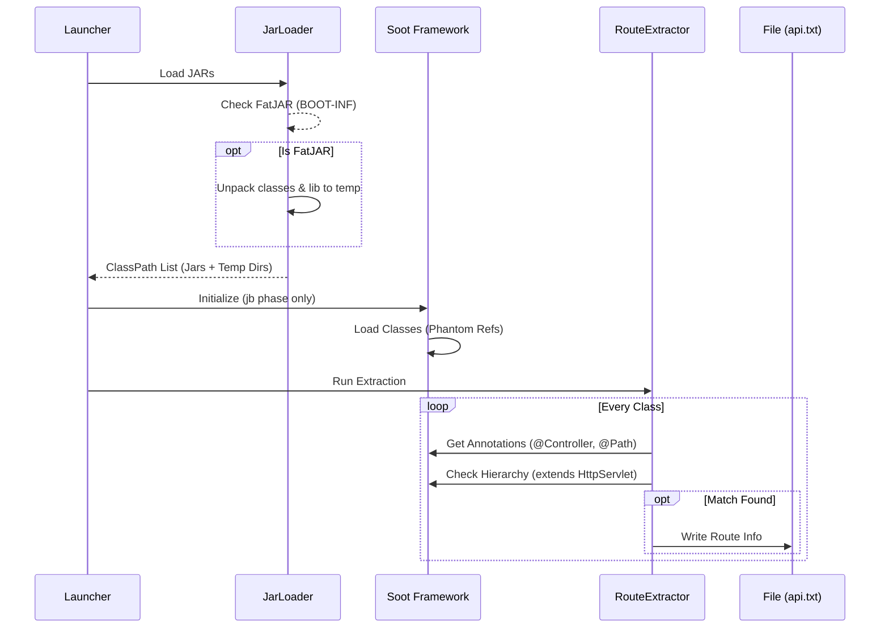

# JByteScanner Software Design Document (SDD)

## 1. Overview

*   **Project Name**: JByteScanner (Java Bytecode Security Scanner)
*   **Core Engine**: Soot 4.5+ (Java Bytecode Optimization and Analysis Framework)
*   **Target Audience**: Security Auditors, Security Researchers
*   **Key Value Proposition**: Single JAR execution, low memory footprint, database-free, highly configurable, and standardized SARIF output.

## 2. Architecture

The tool adopts a **"Dual-Engine Microkernel"** architecture, decoupling lightweight information extraction (API scanning) from heavyweight data flow analysis (vulnerability scanning) to address memory consumption issues found in previous tools.

```mermaid
graph TD
    User[User/Auditor] --> Launcher[Launcher (CLI)]
    Launcher --> ConfigMgr[Config Manager]
    Launcher --> DiscoveryEngine[A. Asset Discovery Engine (Lightweight)]
    Launcher --> TaintEngine[B. Taint Analysis Engine (Heavyweight)]
    
    ConfigMgr --> |Load/Gen| Rules[Rules (yaml)]
    
    DiscoveryEngine --> |Soot (Structure)| JARs[Target JARs]
    DiscoveryEngine --> |Extract| APIDict[api.txt (Route Dict)]
    
    TaintEngine --> |Input| APIDict
    TaintEngine --> |Soot (SPARK/Jimple)| JARs
    TaintEngine --> |Analyze| Vulnerabilities[Vulnerabilities]
    
    Vulnerabilities --> ReportGen[Report Generator]
    ReportGen --> |Export| SARIF[result.sarif]
```

### Core Modules

1.  **Loader Module**
    *   **Responsibility**: Handles input directories, identifying all `.jar`, `.war` files.
    *   **Optimization**: Automatically unpacks nested structures in SpringBoot/FatJARs, extracting `BOOT-INF/classes` and `lib` to build the necessary ClassPath for Soot. **(Implemented in Phase 2)**.
    *   **Fat JAR Support**: Detects `BOOT-INF/classes` or `WEB-INF/classes` inside a JAR. Extracts them to a temporary directory along with dependent libraries (`BOOT-INF/lib/*.jar`) to reconstruct a valid classpath for static analysis.

2.  **Configuration Manager**
    *   **Improvement**: Replaces custom `.conf` formats with **YAML**.
    *   **Logic**: Checks for `rules.yaml` in the current directory on startup. If missing, extracts a default template from the JAR resources; otherwise, loads the existing one. This addresses user pain points regarding configuration persistence and editability.

3.  **Discovery Engine (Lightweight)**
    *   **Goal**: Address Pain Point 1 (API Extraction) and Pain Point 4 (Memory Optimization).
    *   **Technology**: Runs only Soot's `jb` (Jimple Body) phase. **Does not build a global Call Graph.**
    *   **Function**: Rapidly traverses class annotations and inheritance hierarchies to extract Controller/Servlet definitions, outputting `api.txt`.
    *   **Output Strategy**: Uses **Append Mode** for `api.txt`. Each scan session appends a header block `### Scan Session: [Timestamp] | Jars: [Count] ###` followed by the routes. This prevents data loss when scanning multiple projects sequentially.

4.  **Taint Engine (Heavyweight)**
    *   **Technology**: Builds Pointer Analysis and Call Graph using Soot's `SPARK` or `CHA`.
    *   **Strategy**: Uses **"Demand-Driven Analysis"**. Instead of analyzing the entire universe, it uses entry points from `api.txt` to build relevant call subgraphs, significantly reducing memory usage.

5.  **Report Generator**
    *   **Goal**: Address Pain Point 5.
    *   **Format**: Supports SARIF (Standard Static Analysis Results Interchange Format) v2.1.0, enabling direct integration with VSCode, GitHub Security, etc.

## 3. Technology Stack & Principles

### 3.1 Technology Selection
*   **Static Analysis Framework: Soot (4.5+)**
    *   *Rationale*: De facto standard in academic and industrial Java research. Operates on bytecode (no source code required), crucial for the "audit deployment artifacts" use case. Its Jimple IR (Intermediate Representation) simplifies complex Java bytecode instructions into 3-address code, making analysis implementation significantly easier.
*   **CLI Framework: Picocli**
    *   *Rationale*: Modern, type-safe command-line parsing with built-in help generation and sub-command support.
*   **Configuration: YAML (Jackson)**
    *   *Rationale*: Human-readable, widespread adoption, and hierarchical structure suitable for nested rules (Sources/Sinks).
*   **Reporting: SARIF**
    *   *Rationale*: OASIS standard for static analysis tools, enabling seamless integration with CI/CD pipelines (GitHub Actions, GitLab CI) and IDEs (VSCode).

### 3.2 Technical Principles & Algorithms
The core analysis relies on **Inter-procedural Data Flow Analysis**.

#### A. Intermediate Representation (IR)
We utilize **Jimple**, Soot's primary IR. It is a typed, stack-less, 3-address code representation.
*   *Benefit*: Transforms stack-based bytecode (e.g., `aload_0`, `iload_1`, `iadd`) into variable-based statements (e.g., `a = b + c`), simplifying def-use chain construction.

#### B. Call Graph Construction
The tool supports two modes to balance precision and performance:
1.  **CHA (Class Hierarchy Analysis)**:
    *   *Concept*: Conservatively assumes any method overriding a virtual call target could be invoked.
    *   *Pros/Cons*: Extremely fast, low memory, but can introduce false positives (edges to methods that are never called at runtime).
2.  **SPARK (Soot Pointer Analysis Research Kit)**:
    *   *Concept*: Performs points-to analysis to determine which objects a variable can actually point to, filtering out impossible targets.
    *   *Pros/Cons*: More precise, fewer false positives, but computationally expensive.
    *   *Reference*: *Lhoták, O., & Hendren, L. (2003). Scaling Java points-to analysis using Spark.*

#### C. Taint Analysis (Vulnerability Detection)
The engine implements a **Forward Taint Propagation** algorithm.
1.  **Source Identification**: Based on `api.txt` and `rules.yaml`, mark return values of sources (e.g., `request.getParameter()`) as "Tainted".
2.  **Propagation**: 
    *   **Intra-procedural**: Use Soot's `SmartLocalDefs` or `FlowAnalysis` to track taint within a method body via assignments (`y = x` where x is tainted).
    *   **Inter-procedural**: When a tainted variable is passed as an argument to a method call, query the Call Graph to find callee methods and map the argument to the callee's parameters, continuing the analysis recursively.
3.  **Sink Matching**: If a tainted variable reaches a sink method (e.g., `Runtime.exec(tainted)`), a vulnerability is flagged.

*Reference*: *Vallée-Rai, R., Co, P., Gagnon, E., Hendren, L., Lam, P., & Sundaresan, V. (1999). Soot - a Java optimization framework.*

### 3.3 Internal Process Flows

#### Discovery Engine Flow (Phase 2)


#### Taint Analysis Flow (Phase 3/4)
```mermaid
flowchart TD
    A[Start Analysis] --> B{Load Config}
    B --> C[Initialize Soot (Whole Program)]
    C --> D[Build Call Graph (CHA/SPARK)]
    D --> E[Identify EntryPoints (from api.txt)]
    E --> F[Initialize Worklist (Sources)]
    
    F --> G{Worklist Empty?}
    G -- Yes --> H[Generate Report]
    G -- No --> I[Pop Method/Variable]
    
    I --> J[Intra-procedural Propagation]
    J --> K{Reaches Sink?}
    K -- Yes --> L[Record Vulnerability]
    K -- No --> M[Find Callers/Callees]
    
    M --> N[Map Taint to Args/Returns]
    N --> O[Push to Worklist]
    O --> G
```

## 4. Detailed Design & Solutions

### 4.1 Pain Point 1: API Route Extraction (api.txt)

Instead of Regex or ASM, we leverage Soot's superior annotation support. A `RouteExtractor` will be implemented.

*   **Recognition Logic**:
    *   **Spring Boot**: Scan `@RestController`, `@Controller` on classes and `@RequestMapping`, `@GetMapping`, `@PostMapping` on methods. Parse `value` or `path` attributes.
    *   **Servlet**: Scan classes inheriting `javax.servlet.http.HttpServlet` and parse `web.xml` (if present) or `@WebServlet`.
    *   **JAX-RS**: Scan `@Path`.
*   **Output Format**: `METHOD /full/url/path class.method(params)`

### 4.2 Pain Points 2 & 3: Configurable Source/Sink (YAML)

We will use Jackson or SnakeYAML.

**Configuration Structure (rules.yaml):**
```yaml
config:
  max_depth: 10
  scan_packages: ["com.example", "cn.service"] # Limit scan scope

sources:
  - type: "annotation"
    value: "org.springframework.web.bind.annotation.RequestParam"
  - type: "method"
    signature: "<javax.servlet.http.HttpServletRequest: java.lang.String getParameter(java.lang.String)>"

sinks:
  - type: "method"
    vuln_type: "RCE"
    signature: "<java.lang.Runtime: java.lang.Process exec(java.lang.String)>"
```
**Startup Logic**:
```java
File configFile = new File("rules.yaml");
if (!configFile.exists()) {
    ResourceUtil.extract("/default_rules.yaml", "."); 
    Logger.info("Created default rules.yaml.");
}
Config config = ConfigLoader.load(configFile);
```

### 4.3 Pain Point 4: Memory Optimization

High memory usage in previous tools often stems from loading the entire JRE `rt.jar` and building an excessive Call Graph.

**Optimization Strategies:**
1.  **Phantom Refs**: Enable `Options.v().set_allow_phantom_refs(true)`. Do not load implementations of third-party libraries unless necessary.
2.  **Exclusion List**: Aggressively exclude `java.*`, `javax.*`, `sun.*`, `org.slf4j.*` and other non-business logic packages from CallGraph construction.
3.  **CHA vs SPARK**: Default to CHA (Class Hierarchy Analysis) for the base Call Graph as it is faster and memory-efficient. Enable SPARK only with a `--deep` flag.
4.  **Iterative Analysis**: Implement a "Batch Mode" where jars are processed individually or in small groups (resetting `G.reset()`) if inter-service calls are not the focus.

### 4.4 Pain Point 5: SARIF Report

Use `sarif-java-sdk` or manually construct the JSON structure.

```json
{
  "version": "2.1.0",
  "runs": [
    {
      "tool": { "driver": { "name": "JByteScanner" } },
      "results": [
        {
          "ruleId": "RCE",
          "message": { "text": "Detected RCE flow from Controller to Runtime.exec" },
          "locations": [ ... ]
        }
      ]
    }
  ]
}
```
