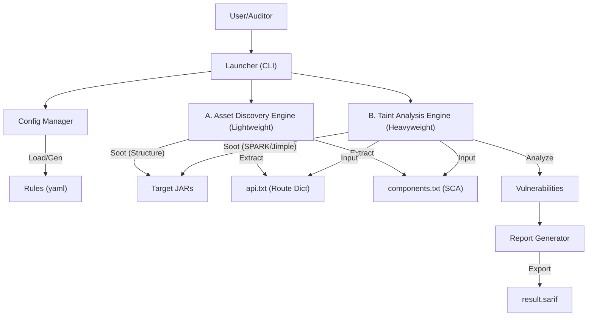

# JByteScanner (Java Bytecode Security Scanner)

**JByteScanner** 是一款基于 [Soot](https://github.com/soot-oss/soot) 框架构建的下一代 Java 字节码静态分析工具。

它专为**现场代码审计**场景设计，无需源代码，直接对部署的 `.jar` 或 `.war` 包进行深度扫描。与 Joern 或 CodeQL 不同，JByteScanner **无需配置数据库**，具有极低的内存占用和极高的运行速度，能够自动处理 Spring Boot Fat JAR 的嵌套结构。

## 🚀 核心特性

*   **无需源码**: 直接分析 Bytecode (字节码)，完美适配现场审计场景。
*   **轻量级架构**: 采用“双引擎”设计（资产发现 + 污点分析），按需构建调用图，大幅降低内存消耗。
*   **微服务支持**: 自动识别并解压 Spring Boot Fat JAR (`BOOT-INF/classes`)，无需人工干预。
*   **资产发现**: 快速提取所有 API 路由（Spring MVC, Servlet, JAX-RS）生成字典，辅助黑盒测试。
*   **高度可配**: 通过 `rules.yaml` 灵活定义 Source/Sink，支持注解和方法签名。
*   **稳定可靠**: 采用“严格依赖隔离”架构，自动区分业务代码与第三方库，避免分析引擎因复杂库结构而崩溃。
*   **标准输出**: 结果支持导出为 `api.txt` 字典和标准 SARIF 格式（开发中）。

## 🛠️ 快速开始

### 1. 构建项目

确保已安装 Maven 和 JDK 11+。

```bash
git clone https://github.com/wuerror/JByteScanner.git
cd JByteScanner
mvn clean package -DskipTests
```

构建完成后，在 `target/` 目录下会生成 `JByteScanner-1.0-SNAPSHOT-shaded.jar`。

### 2. 运行扫描

使用 `java -jar` 命令运行工具，指定目标 Jar 包或包含多个 Jar 包的目录。

**基础用法：**

```bash
# 扫描单个 Jar (执行完整扫描: 资产发现 + 漏洞分析)
java -jar target/JByteScanner-1.0-SNAPSHOT-shaded.jar /path/to/app.jar

# 扫描整个目录
java -jar target/JByteScanner-1.0-SNAPSHOT-shaded.jar /path/to/microservices/
```

**高级用法：API 过滤与独立提取模式**

JByteScanner 支持仅提取 API 列表，并允许通过注解关键词进行筛选（适用于提取特定类型的接口，如匿名访问接口、鉴权接口等）。

```bash
# 模式：仅提取 API (不进行漏洞分析)
# 输出：仅生成 api.txt
java -jar target/JByteScanner-1.0-SNAPSHOT-shaded.jar /path/to/app.jar -m api

# 模式：筛选特定 API (支持模糊匹配注解名或属性值)
# 场景：提取所有带有 "Anonymous" (匿名) 或 "PreAuthorize" (预授权) 相关注解的 API
java -jar target/JByteScanner-1.0-SNAPSHOT-shaded.jar /path/to/app.jar -m api --filter-annotation Anonymous --filter-annotation PreAuthorize

# 模式：筛选并立即扫描 (针对筛选出的 API 进行漏洞检测)
java -jar target/JByteScanner-1.0-SNAPSHOT-shaded.jar /path/to/app.jar -m scan --filter-annotation roleValidator
```

**参数说明：**

*   `-m, --mode`: 运行模式。
    *   `scan` (默认): 完整流程。如果 `api.txt` 已存在且无过滤参数，直接使用；否则重新生成。
    *   `api`: 仅执行资产发现，强制重新生成 `api.txt` 并退出。
*   `--filter-annotation`: 过滤关键词。匹配类或方法上的**注解名称**或**注解属性值**（支持递归匹配嵌套注解）。

### 3. 查看结果


运行结束后，当前目录下会生成 API 路由字典文件：

*   `api_[project_name].txt`: 包含提取到的所有 HTTP 接口信息。

示例输出：
```text
### Project: microservices | Scan Session: 2023-10-27 10:00:00 | Jars: 5 ###
GET /api/user/info com.example.UserController java.lang.String getUser(java.lang.String)
POST /api/login com.example.AuthController void login(java.lang.String,java.lang.String)
```

## ⚙️ 配置说明 (rules.yaml)

首次运行会自动在当前目录生成 `rules.yaml`。你可以修改它来定制扫描规则。

```yaml
config:
  max_depth: 10
  scan_packages: 
    - "com.example"  # [关键] 仅扫描特定包。未匹配的 JAR 将被视为纯库文件(不生成Body)，极大提高稳定性和速度。

sources:
  - type: "annotation"
    value: "org.springframework.web.bind.annotation.RequestParam"

sinks:
  - type: "method"
    vuln_type: "RCE"
    signature: "<java.lang.Runtime: java.lang.Process exec(java.lang.String)>"
```

## 🏗️ 架构设计

JByteScanner 采用双引擎架构：



*   **Discovery Engine**: 只运行 Soot 的基础阶段，快速提取路由和类信息。
*   **Taint Engine**: 基于发现的 API 入口点构建精简的调用图，进行污点追踪。

## 📅 开发路线图

- [x] **Phase 1**: 项目骨架与配置管理系统 (Config/Loader)
- [x] **Phase 2**: 资产发现引擎 (Spring Boot/Servlet API 提取 & Fat JAR 支持)
- [ ] **Phase 2.5**: 组件指纹识别 (SCA) 与版本提取
- [ ] **Phase 3**: 调用图构建 (CHA) 与基础数据流分析
- [ ] **Phase 4**: 污点分析引擎 (Taint Analysis) 与内存优化
- [ ] **Phase 5**: SARIF 报告生成与发布

## 📄 License

MIT License
